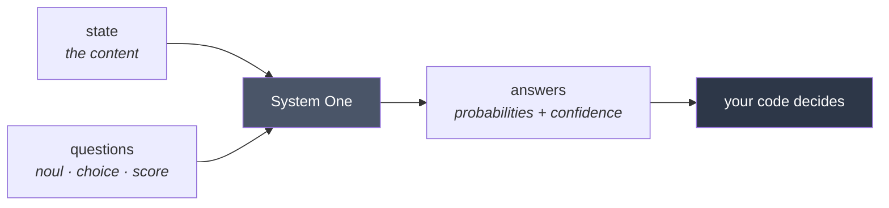
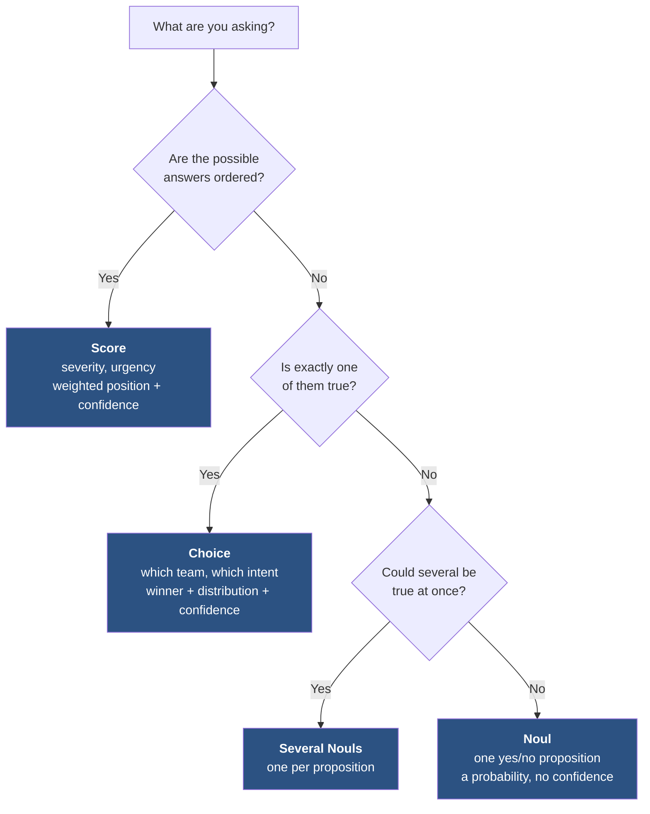
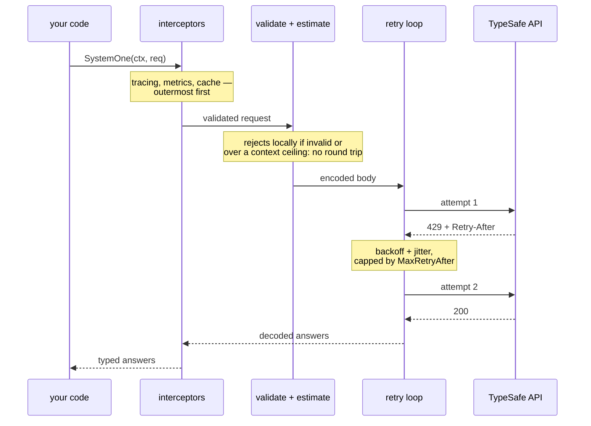
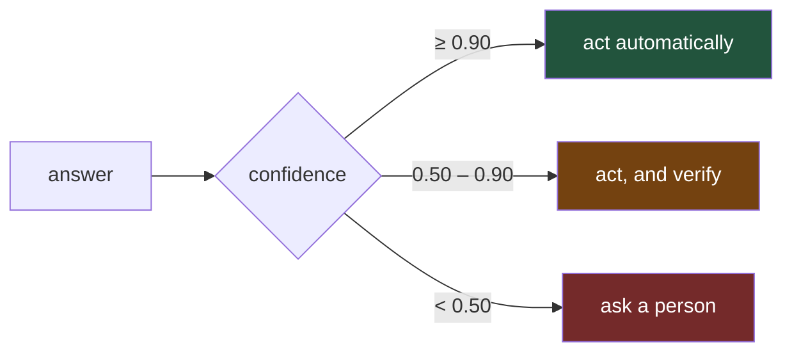
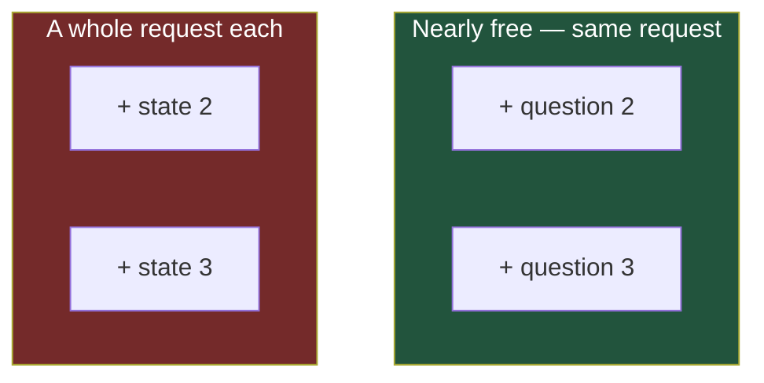
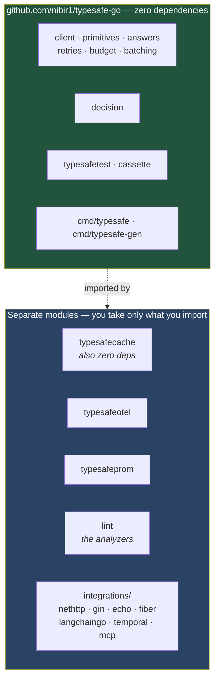
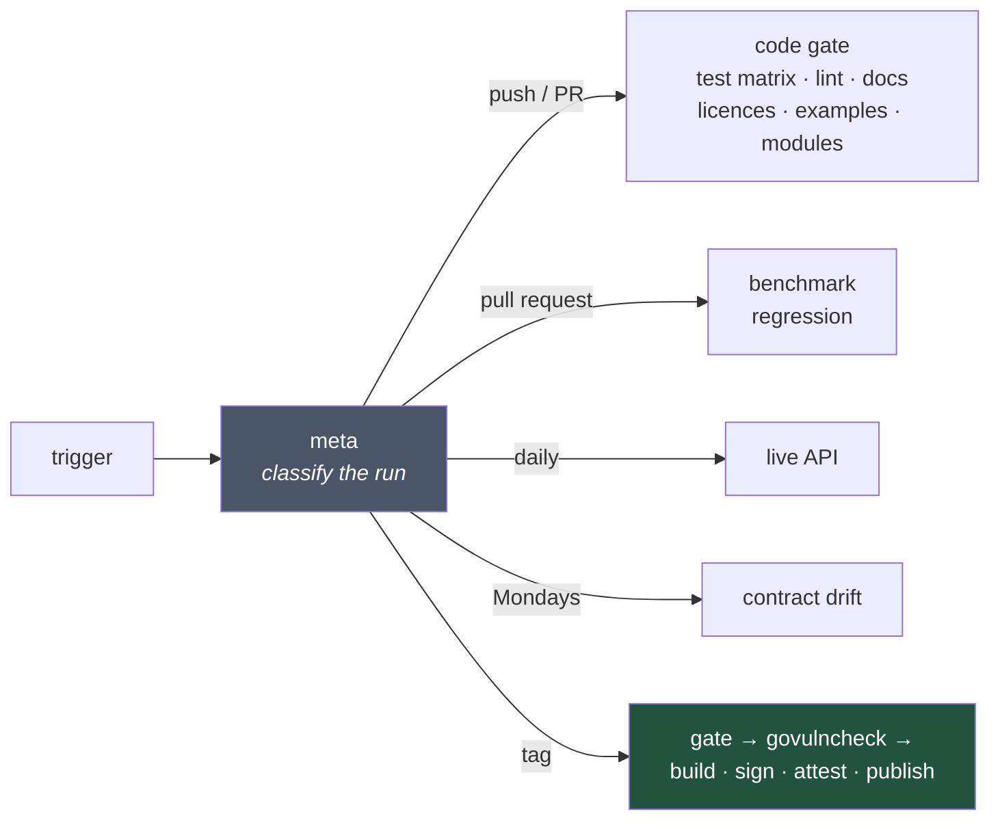

# typesafe-go

[](https://pkg.go.dev/github.com/nibir1/typesafe-go)
[](https://github.com/nibir1/typesafe-go/actions/workflows/ci.yml)
[](https://goreportcard.com/report/github.com/nibir1/typesafe-go)
[](https://go.dev/dl/)
[](#repository-layout)
[](LICENSE)

A community-maintained Go SDK for the [TypeSafe](https://typesafe.ai) **System One** API
and its model, **Jev**.

Send one state and a map of typed questions. Get one typed answer per question, with
calibrated probabilities your code can branch on.

> **Status: ready for `v1.0.0`.** Everything on the roadmap is built and verified
> against the live API. See [Stability](#stability) for what `v1.0` commits to.
>
> Not affiliated with, endorsed by, or sponsored by TypeSafe AI.



---

## Start here

| | |
|---|---|
| **New to this?** | [**User Manual**](docs/MANUAL.md) — a linear read, install to production |
| **Want to see code?** | [examples/](examples) — ten runnable programs, each replayed in CI |
| **Picking a primitive?** | [DECISION_GUIDE.md](docs/DECISION_GUIDE.md) |
| **Coming from Python or JS?** | [MIGRATION.md](docs/MIGRATION.md) |
| **Looking up a symbol?** | [pkg.go.dev](https://pkg.go.dev/github.com/nibir1/typesafe-go) |

<details>
<summary><b>Every document in this repository</b></summary>

**Guides**

| | |
|---|---|
| [docs/MANUAL.md](docs/MANUAL.md) | The user manual: install, primitives, decisions, production |
| [docs/DECISION_GUIDE.md](docs/DECISION_GUIDE.md) | Which primitive to use, and how to word the question |
| [docs/LIMITS.md](docs/LIMITS.md) | Context budget, rate limits, jaggedness, cost |
| [docs/MIGRATION.md](docs/MIGRATION.md) | Coming from the official Python or JavaScript SDK |
| [docs/FAQ.md](docs/FAQ.md) | Short answers |

**Reference**

| | |
|---|---|
| [docs/WIRE_CONTRACT.md](docs/WIRE_CONTRACT.md) | The verified wire contract, and where the published docs are wrong |
| [docs/PERFORMANCE.md](docs/PERFORMANCE.md) | Measured SDK overhead, and the methodology |
| [docs/TESTING.md](docs/TESTING.md) | Mocks, test servers, cassettes, CI recipes |
| [docs/LINTING.md](docs/LINTING.md) | The three analyzers, their rules and their sources |
| [docs/OBSERVABILITY.md](docs/OBSERVABILITY.md) | Tracing, metrics, caching, and the demo stack |
| [docs/INTEGRATIONS.md](docs/INTEGRATIONS.md) | HTTP frameworks, LangChainGo, Temporal, MCP |

**Project**

| | |
|---|---|
| [CHANGELOG.md](CHANGELOG.md) | What changed, written by hand |
| [Release_Notes.md](Release_Notes.md) | The announcement text for each release |
| [CONTRIBUTING.md](CONTRIBUTING.md) | Clone to passing tests, house rules, the release procedure |
| [SECURITY.md](SECURITY.md) | Reporting, supply chain, and what this SDK does with your data |
| [THIRD_PARTY_NOTICES.md](THIRD_PARTY_NOTICES.md) | Dependency and licence register |

</details>

---

## Quickstart

```go
package main

import (
    "context"
    "fmt"
    "log"

    typesafe "github.com/nibir1/typesafe-go"
)

func main() {
    client, err := typesafe.NewClient() // reads TYPESAFE_API_KEY
    if err != nil {
        log.Fatal(err)
    }

    resp, err := client.SystemOne(context.Background(), &typesafe.SystemOneRequest{
        State: "Our API has returned 500s for 20 minutes and we cannot process orders.",
        Questions: map[string]typesafe.Question{
            "is_urgent": typesafe.Noul{
                Instructions: "Does this convey urgency?",
            },
            "department": typesafe.Choice{
                Instructions: "Which team should handle this?",
                Criteria: typesafe.Options{
                    "billing":   "Payments, invoicing, refunds",
                    "technical": "Bugs, outages, integrations",
                    "sales":     nil, // interpreted by its name alone
                },
            },
            "severity": typesafe.Score{
                Instructions: "How severe is the incident?",
                Criteria:     typesafe.Levels{"Cosmetic", "Degraded", "Outage"},
            },
        },
    })
    if err != nil {
        log.Fatal(err)
    }

    urgent, _ := resp.Noul("is_urgent")
    team, _ := resp.Choice("department")
    sev, _ := resp.Score("severity")

    level, label := sev.Nearest()
    fmt.Printf("urgent=%.2f  team=%s (%.2f confident)  severity=%d (%v)\n",
        urgent.Noul, team.Choice, team.Confidence, level, label)
}
```

Real output from the live API:

```
urgent=0.96  team=technical (1.00 confident)  severity=2 (Outage)
```

Every question sees the same state and is evaluated in parallel, so asking three costs
barely more than asking one. Pack every question about a given state into a single call.

---

## The three primitives



Full guidance on wording, catch-all options and thresholds in
[DECISION_GUIDE.md](docs/DECISION_GUIDE.md).


| | Returns | Use it for |
|---|---|---|
| **`Noul`** | one probability, 0–1 | a yes/no judgment |
| **`Choice`** | the winning option + a distribution + confidence | picking one of a set you define |
| **`Score`** | a weighted position + a distribution + confidence | rating against ordered levels |

```go
typesafe.Noul{Instructions: "Is this spam?"}

typesafe.Choice{
    Instructions: "What is the tone?",
    Criteria:     typesafe.Options{"calm": "Neutral or polite", "angry": "Upset or hostile"},
}

typesafe.Score{
    Instructions: "How urgent is this?",
    Criteria:     typesafe.Levels{"Can wait", "This week", "Today"},
}
```

Answers are always members of the set you supplied. There is no parsing step and no
prose to recover a value from.

### A Noul has no confidence, on purpose

`NoulAnswer` carries a single probability and nothing else. Near 0.5 *is* the model
saying it does not know, so a separate confidence field would be redundant.

This matters because the obvious accessor would hide it:

```go
conf, ok := resp.Confidence("is_urgent")
// ok == false for a Noul — it has none.
```

Returning a bare `0` would read as *maximally uncertain* for a 0.96. Absence is
reported, not substituted.

---

## Errors

Every documented failure has a type, and all of them unwrap to `*APIError`:

```go
resp, err := client.SystemOne(ctx, req)

var rl *typesafe.RateLimitError
if errors.As(err, &rl) {
    time.Sleep(rl.RetryAfter) // 0 when the server sent no preference
}

var ue *typesafe.UnprocessableEntityError
if errors.As(err, &ue) {
    for _, d := range ue.Detail {
        log.Printf("%s: %s", d.Path(), d.Msg)
        // body.questions.frustration.criteria: Field required
    }
}

if errors.Is(err, typesafe.ErrOverloaded) { /* 529, retry later */ }
```

`APIError.RequestID` carries `x-typesafe-request-id`, worth quoting in a support ticket.
Credentials are scrubbed from every error string, including when a server echoes your key
back in its response body.

---

## What happens on a call



**An interceptor sees one logical call.** Retries happen beneath it, so a latency
histogram records what the caller waited for rather than one bar per attempt. For
per-attempt visibility use `WithRetryObserver`, which is the layer below.

---

## Retries

On by default, with the same numbers as the official Python and JavaScript SDKs — two
retries, 500ms backoff doubling to a 5s ceiling, ±25% jitter, within a 30s overall
budget. Porting a working integration should not require re-tuning anything.

```go
client, _ := typesafe.NewClient(
    typesafe.WithMaxRetries(5),                  // adjust one field
    typesafe.WithRetryPolicy(typesafe.NoRetry()), // or turn it off
)
```

`408`, `429`, `5xx` and `529` are retried. **`422` never is** — a request that failed
validation will fail identically, and retrying only delays the error.

Three behaviors worth knowing:

- **Retried requests send byte-identical bytes.** The body is marshalled once. Re-doing
  it per attempt would risk a different request, since Go iterates maps randomly.
- **A `retry-after` longer than 30s is not waited out.** The error is returned at once
  with the server's requested delay still on it, rather than parking your caller on the
  server's say-so. Configurable via `MaxRetryAfter`.
- **Backoff never outlasts the budget.** If the next delay would exceed the remaining
  time, the client stops instead of sleeping toward a deadline it will miss.

`ErrRetriesExhausted` wraps the terminal failure rather than replacing it, so
`errors.As` still finds the `*RateLimitError` underneath and existing handling keeps
working.

### Circuit breaker

Off by default. Retrying helps with a blip and hurts during an outage.

```go
breaker := typesafe.NewCircuitBreaker()          // 5 failures, 30s open
client, _ := typesafe.NewClient(typesafe.WithCircuitBreaker(breaker))
```

Only retryable failures count toward opening it — a `422` says your request was wrong,
not that the service is unwell. Share one breaker per upstream.

---

## Testing without a key

`go test ./...` in your project should pass on a laptop with no network and no
credentials. Three doubles, by how much of the client they exercise:

```go
// Unit test: your branching logic, transport incidental.
m := typesafetest.NewMock().On("is_spam", typesafetest.Noul(0.93))

// Integration test: real client, scripted server.
srv := typesafetest.NewServer(t, typesafetest.RateLimited(3), typesafetest.Answers(...))

// Against real recorded answers, replayed offline forever.
hc := cassette.Open(t, "testdata/cassettes/triage.jsonl", cassette.Recording(*update))
```

Cassettes replay through an `http.RoundTripper`, so the SDK's marshalling, status
mapping, and error typing all still run. They are newline-delimited JSON, diffable, and
byte-deterministic — re-record one and an empty diff means the API has not drifted.

Full guide: **[docs/TESTING.md](docs/TESTING.md)**.

---

## Deciding, not just asking

TypeSafe's documentation is consistent: decompose a broad judgment into atomic
questions, ask them together, and combine the answers with deterministic logic in code.
Every SDK hands back a probability distribution and stops there. The `decision` package
is the part that was left as an exercise.

```go
var SpamPolicy = decision.Policy{
    Name: "spam-v3",
    Weights: decision.Weights{
        "asks_for_credentials":  0.4,
        "creates_time_pressure": 0.3,
        "has_suspicious_link":   0.2,
        "generic_greeting":      0.1,
    },
    Normalize:   true,
    ReviewAbove: 0.5,
    BlockAbove:  0.8,
}

result, err := SpamPolicy.Evaluate(resp)
switch result.Verdict {
case decision.Block:  quarantine()
case decision.Review: queueForHuman()
}
```

A `Policy` is **data**, so it round-trips through JSON: thresholds can live in config,
be diffed in review, and reload without a deploy. `Validate()` catches a `ReviewAbove`
above `BlockAbove`, which makes a verdict unreachable with nothing at runtime to say so.

`result.Trace` shows which question contributed what, ordered by contribution. A
probability in an audit log without its derivation is not evidence of anything.

### Probability, done as probability

```go
decision.Or(0.9, 0.8)             // 0.98 — a + b - ab, not a + b
decision.AtLeast(2, 0.5, 0.5, 0.5) // 0.5  — exact Poisson-binomial
decision.MinAll(0.9, 0.9, 0.9)     // 0.9  — no independence assumed
```

`AtLeast` answers a question a weighted sum structurally cannot: *how likely is it that
**several** of these warning signs are real?* A sum of 1.5 cannot distinguish three
half-certain signals from one certain and one absent.

`MinAll`/`MaxAny` exist because independence is sometimes false — ask "is this urgent?"
and "is this time-sensitive?" about the same state and multiplying understates badly.

### Confidence as a second axis



**Low confidence means your options overlap for this input**, not that the input was
vague. Measured: `"hey"` scores **1.00** for `unclear`, because `unclear` is the right
answer. Confidence falls when two options both fit. See
[`confidence_routing`](examples/confidence_routing).


```go
routing := decision.Bands{ActAbove: 0.9, ConfirmAbove: 0.5}
switch routing.Classify(department.Confidence) {
case decision.Act:      route(department.Choice)
case decision.Confirm:  askUser(department.Choice)
case decision.Escalate: routeToHuman()
}
```

`ClassifyAnswer` on a **Noul** returns an error rather than a band — a Noul has no
confidence, and banding one would read a zero and escalate every call.

### Weights from data, not guesswork

```go
report, err := decision.Calibrate(labeledHistory, questionIDs, decision.CalibrationOptions{})
if !report.Separable {
    return fmt.Errorf("these signals do not predict the label:\n%s", report)
}
policy := decision.NewPolicy("spam-v4", report.Weights)
```

Logistic regression, stdlib only. **Check `Separable`** — a fit on noise still returns
weights, and those weights still produce confident-looking verdicts. The bar is the
majority-class rate plus two standard errors, so it scales with how much data you have.

Nothing in `decision` touches the network. Given the same answers it returns the same
verdict, which is what makes a decision replayable months later — enforced by an
architecture test.

---

## Catching mistakes before they cost you

Two checks with no equivalent in any other TypeSafe client.

**Unresolvable state references.** TypeSafe's docs recommend pointing a question at part
of a structured state by backticked path. The server does not resolve these — the model
just sees a path naming nothing and answers anyway. Nothing in the response tells you.

```go
for _, w := range req.CheckReferences() {
    log.Warn(w) // question "q" references `ticket.mesage`, which does not
                // resolve: `ticket` has no key "mesage"
}
```

**Requests that would exceed the context window**, caught before the round trip:

```go
est := req.EstimateTokens()
if err := est.Err(); err != nil {
    return err // never sent
}
```

The API enforces **two** ceilings — 64k for the whole request and 32k for the state plus
any *single* question — and a request can pass the first and fail the second. The
server's error does not say which. The estimator is fitted from live measurement
(`tokens ≈ 239 + 0.331 × wire_bytes`, plus ~240 fixed per call) and deliberately
over-reports by ~25%, because an estimate that is sometimes *under* fails exactly when a
request is near a limit.

`typesafe.Budget` caps requests and tokens per window and refuses before any network
I/O, so a runaway loop costs nothing.

**Requests the server would reject**, caught before the round trip:

```go
warnings, err := req.Validate()
// err      — a Score with 11 levels, a Choice with no options, a missing state
// warnings — legal, but probably not what you meant
```

The Score ceiling is a good example of why this exists: the API caps a rubric at **10
levels** and returns `400` above that. Neither the OpenAPI schema nor the prose
documentation mentions the limit. We found it by sending eleven.

---

## Composing it into an application

Interceptors wrap one *logical* call — retries happen beneath, so a latency histogram
records what the caller waited for rather than one bar per attempt:

```go
client, _ := typesafe.NewClient(
    typesafe.WithInterceptor(tracing, metrics, typesafe.WithLogging(slog.Default())),
    typesafe.WithRequestID(uuid.NewString),
    typesafe.WithHooks(typesafe.Hooks{
        OnResponse: func(ctx context.Context, i typesafe.CallInfo) {
            log.Printf("%s: %d tokens in %s", i.RequestID, i.InputTokens, i.Duration)
        },
    }),
)
```

They compose outermost-first. A panic in an interceptor or hook becomes a
`*PanicError` with the stack intact, rather than taking down the request path.

`WithLogging` logs the request id, question count, duration, model and usage — and
never the state, which is your data and routinely holds personal information.

### Fan-out

```go
results := client.SystemOneAll(ctx, reqA, reqB, reqC) // positional, one error each
r := <-client.SystemOneAsync(ctx, req)
```

Every question about *one* state belongs in a single request — they run in parallel
server-side. This is for fanning out over different states.

### Batching thousands of states

```go
result := client.SystemOneBatch(ctx, states, typesafe.Questions{
    "is_urgent": typesafe.Noul{Instructions: "Does this convey urgency?"},
    "team":      typesafe.NewChoice("Which team?").Options("billing", "technical"),
}, typesafe.WithConcurrency(16))

if err := result.Err(); err != nil {
    log.Print(err) // "3 of 1000 batch items failed \n 2 x ... \n 1 x ..."
}
for i, item := range result.Items { // input order, always
    if item.Err != nil {
        continue // one failure never aborts the batch
    }
    use(i, item.Response)
}
```



A bounded worker pool with **per-item error isolation**, results **in input order**,
and a summed `Usage`. `SystemOneAll` is the unbounded form for a handful of requests;
this is the one for thousands.

Concurrency adapts **globally**: when any worker meets a `429` or `529` the limit for
the whole batch halves, and it climbs back one at a time after a run of successes —
never above the `WithConcurrency` ceiling you set. Without a shared limit, every worker
independently rediscovers the same rate limit while the batch keeps pushing at the rate
that caused it. `WithAdaptiveConcurrency(false)` pins it.

It batches **states, never questions**. Jev ingests the state once and evaluates every
question against it in parallel, so a second question costs only its own tokens while a
second state costs a whole request.

For a batch too large to hold in memory, or when downstream work can start on the first
result, range over the stream instead — results arrive in *completion* order, and
`ItemResult.Index` gives the input position:

```go
for i, item := range client.SystemOneBatchSeq(ctx, states, qs) {
    ...
    if enough { break } // cancels the batch; no goroutine outlives the loop
}
```

Breaking out is the only thing that drops a pending result — nobody is waiting for it.
A cancelled *context* still yields one item per input, each carrying the context error,
so a consumer can tell "cancelled after three" from "cancelled before anything started".

### Compile-time typed questions

Declare the option set once, as a Go enum, and the compiler checks both ends:

```go
type Topic string

const (
    TopicBilling   Topic = "billing"
    TopicTechnical Topic = "technical"
    TopicOther     Topic = "other"
)

q := typesafe.TypedChoice[Topic]("Which team should handle this?",
    typesafe.OptionOf(TopicBilling, "Invoices, charges, refunds"),
    typesafe.OptionOf(TopicTechnical, "Bugs, outages, API errors"),
    typesafe.OptionOf(TopicOther, nil), // null description, read by name alone
)

ans, err := q.Answer(resp, "department")
switch ans.Choice {          // Topic, not string
case TopicBilling:   ...
case TopicTechnical: ...
}
ans.Probabilities[TopicBilling] // map[Topic]float64
```

`TypedScore` does the same for a rubric, where a level's position **is** its score:

```go
type Frustration int
const (
    Calm Frustration = iota
    Annoyed
    Angry
)

q := typesafe.TypedScore[Frustration]("How frustrated is the customer?",
    typesafe.LevelOf(Calm, "No sign of irritation"),
    typesafe.LevelOf(Annoyed, "Clearly unhappy, still civil"),
    typesafe.LevelOf(Angry, "Hostile, threatening to leave"),
)

if ans.AtOrAbove(Angry) > 0.8 { escalate() }
```

A rubric declared out of order would map every answer to the wrong label with nothing
in the score to reveal it, so `Validate` rejects one whose values do not match their
positions.

These are wrappers, not a parallel implementation: each embeds the plain question and
marshals through the same code, so the JSON is byte-identical and `Untyped()` converts
an answer back losslessly.

`Exhaustive` catches the one thing types cannot — an answer naming an option the
question never declared, which means the request and the enum have drifted apart:

```go
if err := typesafe.Exhaustive(ans, AllTopics...); err != nil { ... }
```

The question's own `Answer` method does this for you, against the set it declared.

### Generating questions from enums

```bash
go install github.com/nibir1/typesafe-go/cmd/typesafe-gen@latest
```

```go
//go:generate typesafe-gen -type TicketQuestions

// TicketQuestions is everything asked about one support ticket.
type TicketQuestions struct {
    // Which team should handle this ticket?
    Department Topic `typesafe:"choice"`

    // How severe is the problem described here?
    Severity Severity `typesafe:"score,id=severity"`
}
```

Generates `Questions()`, a typed constructor and a checked accessor per field, and an
`AllTopic` slice — descriptions taken from each constant's doc comment. The option set
otherwise exists twice, as the enum the code switches on and as the criteria map the
request carries, and nothing reports it when they drift.

### Fluent constructors

```go
typesafe.NewChoice("Which team should handle this?").
    Option("billing", "Payments, invoicing, refunds").
    Option("technical", "Bugs, outages, integrations")
```

Structs remain the documented default; both forms marshal byte-identically and get the
same validation.

---

## Tracing, metrics and caching

Three optional modules, each its own Go module so the core stays dependency-free:

```go
tracer  := typesafeotel.New()
metrics := typesafeprom.New()
cache, _ := typesafecache.New(typesafecache.WithTTL(10 * time.Minute))

client, err := typesafe.NewClient(
    typesafe.WithInterceptor(
        tracer.Interceptor(),   // outermost
        metrics.Interceptor(),
        cache.Interceptor(),    // innermost, so a hit is still traced and timed
    ),
    typesafe.WithRetryObserver(func(ctx context.Context, a typesafe.AttemptInfo) {
        tracer.RetryObserver()(ctx, a)
        metrics.RetryObserver()(ctx, a)
    }),
)
```

**`typesafeotel`** turns a retried call from one unexplained span into a tree:

```
typesafe.systemone                    412ms
├── typesafe.attempt 1                 38ms  error, 429
├── typesafe.attempt 2                 41ms  error, 429
└── typesafe.attempt 3                310ms  ok
```

**`typesafeprom`** exposes latency, errors by class, retries, tokens, batch outcomes —
and **answer confidence**, which has no equivalent in an ordinary API client. A drift in
the confidence distribution is the earliest visible sign that your inputs changed shape;
it moves long before latency or errors do.

**`typesafecache`** keys on the **resolved** model id, never the alias you asked for.
`jev-latest` moves without notice, and a cache keyed on the alias would keep serving
answers from the previous model version with nothing in the response to reveal it. When
an alias starts resolving elsewhere, every entry under the old id becomes unreachable at
once — and `Event.AliasMoved` tells you it happened.

Failures are never cached: a cached error is a cached outage.

`deploy/docker-compose.yml` runs the whole thing against Jaeger, Prometheus and Grafana
with a committed dashboard. Full guide in [docs/OBSERVABILITY.md](docs/OBSERVABILITY.md).

---

## Integrations

Seven modules, each with its own `go.mod`, so importing the SDK drags none of them in:

```go
// net/http, gin, echo, fiber — client injection plus request-id correlation
r.Use(tsgin.Middleware(client), tsgin.Correlation())

// langchaingo — a classification tool whose answer cannot be a value nobody declared
agent := agents.NewOneShotAgent(llm, []tools.Tool{classifier})

// temporal — the API call in an Activity, which is the only replay-safe place for it
tstemporal.Register(w, tstemporal.NewActivities(client))

// mcp — serve TypeSafe to an agent over the Model Context Protocol
srv.Run(ctx, &mcp.StdioTransport{})
```

The HTTP middlewares are thin by design. The half worth having is **correlation**:
the inbound `X-Request-Id` becomes the SDK's request id, so one id ties the HTTP
request, this SDK's logs and TypeSafe's own records together. Without it, correlating
an answer with the request that caused it means joining on timestamps.

### `evaluate_policy`, which no other MCP server offers

```bash
go install github.com/nibir1/typesafe-go/integrations/mcp/cmd/typesafe-mcp@latest
typesafe-mcp -policies ./policies -only-policies
```

A thin MCP proxy lets an agent ask anything. This inverts it: the agent names a
policy and supplies text, while the questions, weights and thresholds stay on the
server. The agent never sees them, cannot drift from them, and cannot be talked out
of them by the text it is judging. What comes back is a verdict and the arithmetic:

```json
{
  "verdict": "review",
  "score": 0.6833,
  "contributions": [
    {"question": "is_abusive", "weight": 2, "value": 0.62, "contribution": 1.24},
    {"question": "is_spam",    "weight": 1, "value": 0.81, "contribution": 0.81}
  ]
}
```

Full guide in [docs/INTEGRATIONS.md](docs/INTEGRATIONS.md).

---

## Static analysis

Three `go/analysis` analyzers, in a separate module so the core keeps its zero
dependencies:

```bash
go install github.com/nibir1/typesafe-go/lint/cmd/typesafe-lint@latest
go vet -vettool=$(which typesafe-lint) ./...
```

| | Catches |
|---|---|
| `atomicquestion` | Compound questions — one probability covering two propositions, which no threshold can split apart |
| `jaggededge` | Questions hitting a **documented** Jev failure mode: counting, date comparison, hex values, double negatives, generation, inverted Noul criteria |
| `confidencecheck` | Branching on an answer without reading its confidence; bare threshold literals; discarding the `ok` from `Confidence()` |

Every `jaggededge` rule cites a section of TypeSafe's published model-jaggedness notes
and repeats its recommended fix. That makes it a conformance checker rather than an
opinion:

```
Noul instructions contain "how many". Jev does not count reliably — it recognizes
the shape of an answer rather than tallying, and the error grows with the size of
the thing being counted. Ask one Noul per item and sum the answers in code
(jaggedness: Math and Numbers: Counting)
```

`//nolint:jaggededge <reason>` suppresses a finding, and a suppression **without** a
reason is itself reported.

---

## Configuration

Resolution order, matching the official Python and JavaScript SDKs, so a process already
configured for either works here unchanged:

| Setting | Order | Default |
|---|---|---|
| API key | `WithAPIKey` → `TYPESAFE_API_KEY` → error | — |
| Base URL | `WithBaseURL` → `TYPESAFE_BASE_URL` → default | `https://api.typesafe.ai` |
| Model | per-request → `WithDefaultModel` → `TYPESAFE_DEFAULT_MODEL` → default | `jev-latest` |
| Timeout | `WithTimeout` → default | `10s` per operation |

```go
client, err := typesafe.NewClient(
    typesafe.WithDefaultModel("jev-1.13.0"), // pin a version; aliases move
    typesafe.WithTimeout(5*time.Second),
    typesafe.WithLogger(slog.Default()),
)
```

The logger never receives your API key or your request state.

---

## Command line

```bash
go install github.com/nibir1/typesafe-go/cmd/typesafe@latest
```

```bash
# Ask three questions about a ticket, no file needed
typesafe run --state-text "Payouts have failed for 3 days" \
  --noul urgent="Does this convey urgency?" \
  --choice team="billing,technical,sales" \
  --score severity="Low,Medium,High"

typesafe estimate -f request.json   # tokens and cost, sends nothing
typesafe lint -f request.json       # problems, before you pay for them
typesafe doctor                     # why is my setup not working?
typesafe explain --policy p.json --answer is_spam=0.93
```

Also `models`, `record`, `replay`, `completion`, and `version`. Everything except
`run`/`models`/`doctor`/`record` works offline with no key.

`doctor` returns a distinct exit code per cause — 3 credential, 4 network, 7 unknown
model, 6 rate limited — so a script can branch without parsing stderr.

The binary has **no dependencies either**: stdlib `flag`, no CLI framework.

---

## Requirements

**Go 1.23+.** The core module has **zero third-party dependencies**, and CI fails if that
ever changes.

---

## Repository layout



Importing `github.com/nibir1/typesafe-go` pulls in **nothing**. `make deps-graph`, a
CI job and a `depguard` lint rule all assert it, because they fail differently.


```
.                      the typesafe package — client, primitives, answers,
                       retries, budget, middleware, batching
├── decision/          ★ composition: algebra, policies, bands, calibration
├── cassette/          record and replay real API traffic
├── typesafetest/      mock, test server, assertions
├── cmd/typesafe/      the CLI — same module, so still zero dependencies
├── cmd/typesafe-gen/  ★ go:generate questions from Go enums
├── typesafecache/     ★ response cache — SEPARATE module, still zero deps
├── typesafeotel/      OpenTelemetry tracing — SEPARATE module
├── typesafeprom/      Prometheus metrics — SEPARATE module
├── integrations/      ★ nethttp, gin, echo, fiber, langchaingo, temporal, mcp
│                      — SEPARATE modules, one per framework
├── deploy/            docker-compose stack, Grafana dashboard, worked example
├── lint/              ★ the analyzers — a SEPARATE module (needs x/tools)
│   ├── atomicquestion/  jaggededge/  confidencecheck/
│   └── cmd/typesafe-lint/
├── internal/          canonical JSON, state paths, token estimator, fixtures
├── tests/
│   ├── contract/      offline: fixtures vs the locked wire contract
│   ├── typecheck/     negative-compilation tests for the typed API
│   └── integration/   live API, build-tagged
├── testdata/
│   ├── contract/      golden request/response pairs
│   └── spec/          vendored OpenAPI document
├── docs/  scripts/  Makefile
```

**The library lives at the module root** so the import path stays
`github.com/nibir1/typesafe-go` rather than stuttering into `.../typesafe-go/typesafe`.

**`lint/`, `typesafeotel` and `typesafeprom` are separate modules** because they need
`golang.org/x/tools`, `go.opentelemetry.io/otel` and `client_golang` respectively. That
split is what keeps the core's zero-dependency guarantee true — importing the SDK pulls
in nothing, and `make deps-graph` asserts it.

**`typesafecache` is separate too**, though it has no dependencies of its own: a caller
who does not want a cache should not carry one.

---

## Development

```bash
make            # list every target
make verify     # the full offline gate — run before pushing
make live       # the above, plus the live API (needs a key)
```

### One workflow

Everything runs from `.github/workflows/ci.yml` — the code gate, linting,
documentation checks, drift detection, the live API and releases. A `meta` job
classifies the run once and every other job states its condition in one line.



### Releasing

```bash
make release                                  # dry run
make release VERSION=v1.0.0 CONFIRM=yes       # for real
```

The release body is the matching section of [Release_Notes.md](Release_Notes.md).
Dry run is the default and the script asks you to type the version, because
pushing a tag is not undoable — the module proxy caches a version within minutes
and deleting the tag does not unpublish it. Full procedure in
[CONTRIBUTING.md](CONTRIBUTING.md#releasing).

`make verify` runs: tidy check, gofmt, `go vet` under both build tags, the
zero-dependency assertion, race tests, the contract suite, fixture validation against the
OpenAPI schema, a credential scan over every committed fixture, and a doc-coverage check.

To enable the live targets, put your key where git will not see it:

```bash
printf 'TYPESAFE_API_KEY=%s\n' "$YOUR_KEY" > .env.local && chmod 600 .env.local
```

`.env.local` is gitignored, and `make verify` fails if it ever becomes tracked.

---

## Documentation

| | |
|---|---|
| [**docs/MANUAL.md**](docs/MANUAL.md) | **The user manual — start here.** Install to production, in one read |
| [docs/WIRE_CONTRACT.md](docs/WIRE_CONTRACT.md) | The verified wire contract, and every place the published docs are wrong |
| [docs/TESTING.md](docs/TESTING.md) | Testing without a key |
| [docs/LINTING.md](docs/LINTING.md) | The three analyzers, their rules, and CI wiring |
| [docs/OBSERVABILITY.md](docs/OBSERVABILITY.md) | Tracing, metrics, caching, and the demo stack |
| [docs/INTEGRATIONS.md](docs/INTEGRATIONS.md) | HTTP frameworks, LangChainGo, Temporal, MCP |
| [docs/DECISION_GUIDE.md](docs/DECISION_GUIDE.md) | Which primitive to use, and how to word the question |
| [docs/LIMITS.md](docs/LIMITS.md) | Context budget, rate limits, jaggedness, cost |
| [docs/PERFORMANCE.md](docs/PERFORMANCE.md) | Measured overhead and the methodology |
| [docs/MIGRATION.md](docs/MIGRATION.md) | Coming from the Python or JavaScript SDK |
| [docs/FAQ.md](docs/FAQ.md) | Short answers |
| [CHANGELOG.md](CHANGELOG.md) | What changed, written by hand |
| [Release_Notes.md](Release_Notes.md) | The announcement text for each release |
| [CONTRIBUTING.md](CONTRIBUTING.md) | Clone to passing tests, and the house rules |
| [SECURITY.md](SECURITY.md) | Reporting, supply chain, and what this SDK does with your data |
| [examples/](examples) | Ten runnable programs, each replayed in CI |
| [THIRD_PARTY_NOTICES.md](THIRD_PARTY_NOTICES.md) | Attribution register |

`WIRE_CONTRACT.md` is worth reading before building anything non-trivial. Several things
the official documentation states are contradicted by the live API, including the Score
minimum, the Score maximum, the `400` status, the shape of `detail`, and the format of
`release_date`.

---

## Stability

### The API

`v1.0.0` follows [Semantic Versioning](https://semver.org/) strictly. Everything
outside `internal/` is public API, and **a breaking change to it requires a major
version**. In practice that means:

- No exported symbol is removed or renamed in a 1.x release.
- No function signature changes in a 1.x release.
- Anything to be removed is marked `// Deprecated:` for at least one minor cycle
  first, with the replacement named in the comment.
- New fields may be added to structs you construct with field names. Construct
  them that way — an unkeyed struct literal will break, and that is on you.

Three things are explicitly **not** covered:

- **`internal/`** is not public, whatever your editor lets you import.
- **Behaviour that depends on the API's answers.** A probability is not a
  contract. If Jev starts answering a question differently, that is a change in
  the model, not in this SDK.
- **The wire contract corrections** in [docs/WIRE_CONTRACT.md](docs/WIRE_CONTRACT.md).
  They describe what the server does today. If TypeSafe changes it, this SDK
  follows, and the drift workflow is what notices.

### Go versions

The core module supports **the current stable Go release and the four before
it** — today, Go 1.23 through 1.27. Raising the floor is a minor-version event,
announced one cycle ahead.

Optional modules sit higher where a dependency forces it: 1.24 for
`langchaingo`, 1.25 for OpenTelemetry, Prometheus, the web frameworks and MCP,
1.26 for Temporal and the analyzers. **That constrains those modules, not you** —
the core and `integrations/nethttp` build on 1.23, and nothing stops a Go 1.23
program using the SDK without them.

### Submodules version independently

`typesafecache`, `typesafeotel`, `typesafeprom`, `lint` and every
`integrations/*` module has its own `go.mod` and its own tag. A breaking change
in one does not force a major bump in the rest, and you take only what you
import.

### The model alias

The SDK defaults to `jev-latest`, matching the official SDKs, and **never pins a
version on your behalf**. Aliases move without notice. Pin an exact model id if
you need reproducibility — and if you use the cache, read
[the alias section](docs/OBSERVABILITY.md), which is built around this.

---

## How this compares

Six Go clients for this API were **downloaded and read** on 2026-09-18, not judged by
their READMEs. The result is worth stating plainly: the client layer is solved, six
times over, by people who read the same documentation.

| | The Go field (6 SDKs) | This SDK |
|---|---|---|
| `NoulAnswer` correctly has no `Confidence` | 6/6 | ✓ |
| `instructions` typed as a union, not `string` | 6/6 | ✓ |
| `422` handled as the validation error | 6/6 | ✓ |
| `retry-after` honoured | 6/6 | ✓ |
| Retry defaults matching the official SDK | 6/6 | ✓ |
| Zero third-party dependencies | 6/6 | ✓ |
| `529` handled | 5/6 | ✓ |
| Ordered `Score` accessors (numeric key sort) | 3/6 | ✓ |
| Record/replay cassettes | 1/6 partial | ✓ |
| **Context-budget awareness (64k / 32k)** | **0/6** | ✓ |
| **Composition layer (`decision`)** | **0/6** | ✓ |
| **Mock client and test server** | **0/6** | ✓ |
| **Static analyzers** | **0/6** | ✓ |
| **Batch API** | **0/6** | ✓ |

Everything in the top half is table stakes, and this SDK pays it. Everything in the
bottom half is what it is actually for.

Two of the six — `Tangerg/typesafe-sdk-go` and `zhirschtritt/typesafe-go` — are
genuinely well built, and two of them cap `retry-after` at a maximum, which is the
sophisticated behaviour. This is not a weak field.

**Against the official Python and JavaScript SDKs**, no comparison table is offered
here. Their defaults and features are theirs to document, a table would go stale, and
you are better served by reading them. What is verified — the retry defaults, which
this SDK matches deliberately — is in [MIGRATION.md](docs/MIGRATION.md).

---

## Roadmap

Built and verified:

- **Phase 0** — wire contract locked, OpenAPI vendored, 10 golden fixtures, drift detection
- **Phase 1** — client, options, typed errors, `/v1/models`
- **Phase 2** — `Noul`/`Choice`/`Score`, typed answers, validation, reference checking
- **Phase 3** — cassettes, mock, test server, canonical hashing
- **Phase 4** — retries, backoff, retry budget, circuit breaker
- **Phase 6** — **the `decision` package**: probability algebra, weighted policies,
  confidence bands, routing, and weight calibration from labeled data
- **Phase 7** — context-budget and cost pre-flight, quota guard
- **Phase 8** — the `typesafe` CLI
- **Phase 9** — **three static analyzers**: `atomicquestion`, `jaggededge`,
  `confidencecheck`
- **Phase 10** — interceptors, hooks, async fan-out, fluent constructors
- **Phase 11** — **batching**: bounded worker pool, per-item error isolation, input
  ordering, globally adaptive concurrency, and an `iter.Seq2` streaming view
- **Phase 12** — **compile-time typed questions**: `TypedChoice`/`TypedScore` over your
  own enums, `Exhaustive` drift detection, and `typesafe-gen`
- **Phase 13** — **observability and caching**: `typesafeotel`, `typesafeprom`, and a
  response cache keyed on the resolved model id
- **Phase 14** — **integrations**: four HTTP middlewares, LangChainGo, Temporal, and an
  MCP server with `evaluate_policy`
- **Phase 15** — **docs and DX**: ten runnable examples replayed in CI, benchmarks with
  a regression gate, and the guides above
- **Phase 16** — **release engineering**: pinned CI, signed and provenance-attested
  releases, an SBOM, a licence audit, and the tooling that makes every submodule
  actually installable

Everything planned is built. The design history — the phase plan, the competitive
audit and every correction made along the way — is kept in the working tree rather
than published.

---

## License

Apache-2.0. See [LICENSE](LICENSE) and [NOTICE](NOTICE).

"TypeSafe", "System One", and "Jev" are names used by TypeSafe AI to identify their API
and models, used here only to describe what this software interoperates with.
