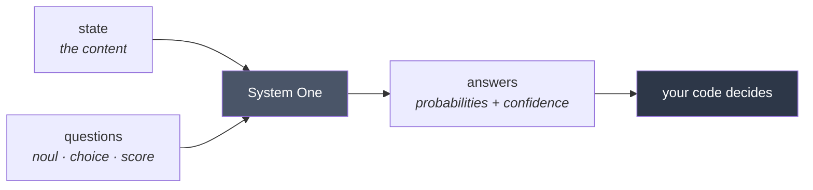
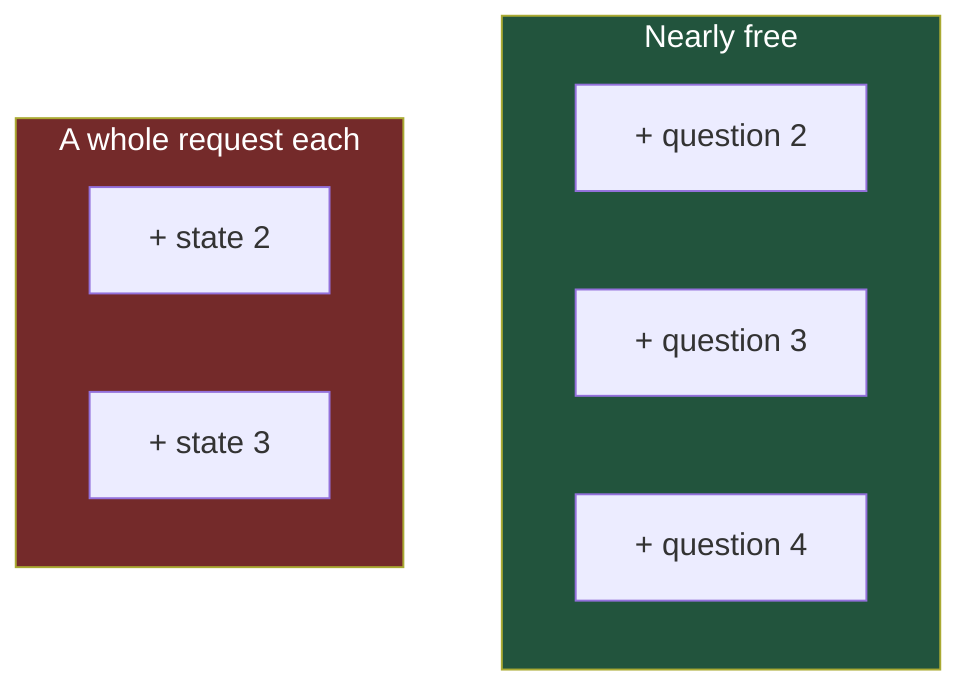
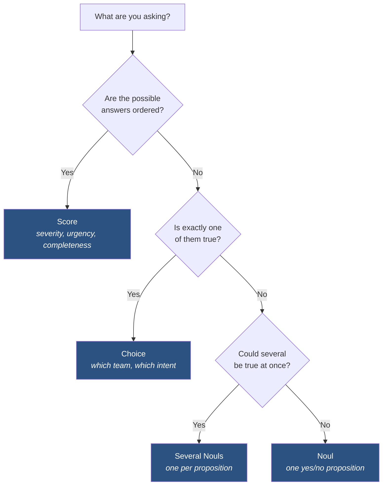
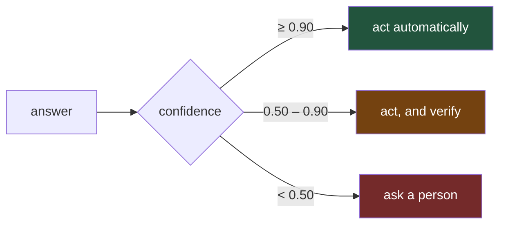
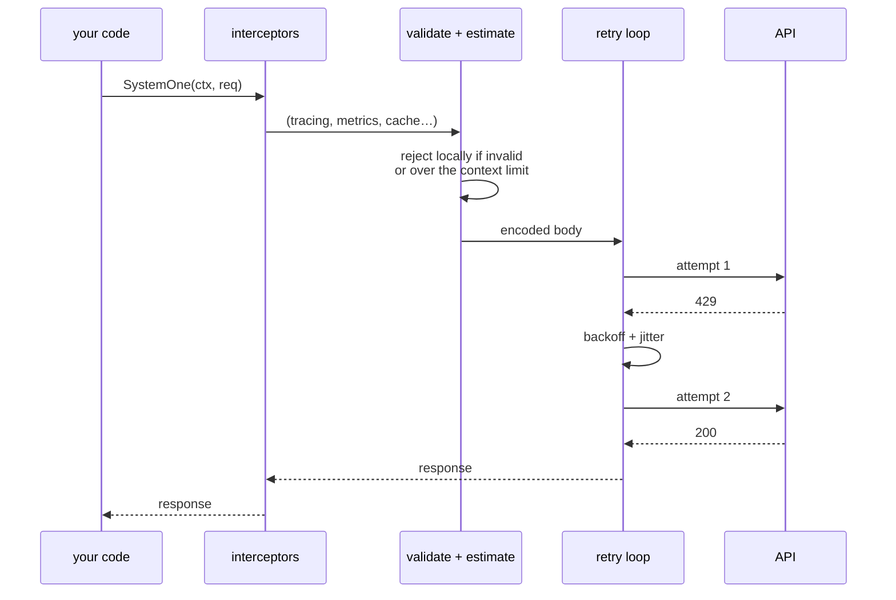
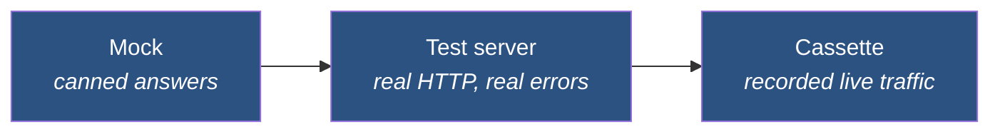

# User Manual

A linear read, from installing to running in production. Roughly an hour end
to end; the first three sections are twenty minutes and enough to ship
something.

If you want a reference instead, [pkg.go.dev](https://pkg.go.dev/github.com/nibir1/typesafe-go)
has every symbol. This is the part that documentation of that kind cannot tell
you: which thing to reach for, and why.

---

## Contents

1. [What this is for](#1-what-this-is-for)
2. [Install and first call](#2-install-and-first-call)
3. [The mental model](#3-the-mental-model)
4. [The three primitives](#4-the-three-primitives)
5. [Reading answers](#5-reading-answers)
6. [Turning answers into decisions](#6-turning-answers-into-decisions)
7. [Errors and resilience](#7-errors-and-resilience)
8. [Cost and limits](#8-cost-and-limits)
9. [Testing](#9-testing)
10. [Going to production](#10-going-to-production)
11. [Troubleshooting](#11-troubleshooting)

---

## 1. What this is for

TypeSafe's System One answers **questions about text** with calibrated
probabilities. It does not generate prose. You give it a piece of content — the
*state* — and a set of named questions, and you get one answer per question.



### When it is the right tool

- Classifying, routing, moderating, triaging, extracting a flag.
- Checking another model's output before it reaches a user.
- Anything where you currently ask an LLM for JSON and hope it parses.

### When it is not

- Generating text. Use a generative model.
- Counting, arithmetic, date comparison, decoding. See
  [§8](#8-cost-and-limits) — these fail quietly.
- Anything needing a guarantee. A probability is evidence, not proof.

### Why a probability beats a boolean

A classifier returning `true`/`false` makes the threshold decision *for* you,
invisibly, and at a point you did not choose. `0.51` and `0.99` become the same
answer and you lose the ability to treat them differently — which is exactly
what you want to do.

The threshold belongs in your code because it is a product decision: the point
where you would rather be wrong one way than the other. That is not something
a model has a view on.

---

## 2. Install and first call

```bash
go get github.com/nibir1/typesafe-go
```

Nothing comes with it. The core module has no third-party dependencies, and
three separate checks in CI keep it that way.

```bash
export TYPESAFE_API_KEY=...
```

```go
package main

import (
    "context"
    "fmt"
    "log"

    typesafe "github.com/nibir1/typesafe-go"
)

func main() {
    client, err := typesafe.NewClient()
    if err != nil {
        log.Fatal(err)
    }

    resp, err := client.SystemOne(context.Background(), &typesafe.SystemOneRequest{
        State: "Help! My payouts have been failing for 3 days.",
        Questions: typesafe.Questions{
            "is_urgent": typesafe.Noul{
                Instructions: "Does this message convey urgency?",
            },
        },
    })
    if err != nil {
        log.Fatal(err)
    }

    urgent, err := resp.Noul("is_urgent")
    if err != nil {
        log.Fatal(err)
    }

    fmt.Printf("urgency: %.2f\n", urgent.Noul)   // urgency: 0.93
    if urgent.Bool(0.8) {
        escalate()
    }
}
```

### Check your setup before you debug your code

```bash
go install github.com/nibir1/typesafe-go/cmd/typesafe@latest
typesafe doctor
```

```
  ok    API key        TYPESAFE_API_KEY is set (108 characters)
  ok    connectivity   reached https://api.typesafe.ai
  ok    credential     accepted
  ok    models         2 available: jev-latest, jev-preview
  ok    evaluation     round trip succeeded, 273 input tokens
```

`doctor` exits non-zero with a distinct code per failure class, so it works in
a startup check as well as by hand.

### One client per process

```go
// Build once, at startup. Share it.
var client *typesafe.Client
```

`*Client` is safe for concurrent use. A per-request client throws away the
connection pool, the circuit breaker's state and the budget's accounting — none
of which mean anything inside a single request.

---

## 3. The mental model

### The state is the expensive part

Every request carries the whole state, and **only input tokens are billed**.
This single fact drives most of the API's shape:



Jev ingests the state once and evaluates every question against it in parallel.
A second question costs only its own tokens; a second *state* costs a whole
request including the envelope.

**So: pack every question about one piece of content into one call, and fan out
across content.** This is why `SystemOneBatch` batches states and never
questions, and why [`speculative_fanout`](../examples/speculative_fanout) asks
questions it might not need rather than making a second round trip.

### Answers are independent

Questions in one request do not see each other's answers. If question B depends
on question A's outcome, you need either two round trips or — better — to ask
both and branch locally.

### The model is confident more often than you expect

Across the examples in this repository, the lowest confidence on unambiguous
input was 1.00 and the only sub-0.5 answers came from genuine ambiguity between
options. Do not tune your thresholds from intuition; measure them on your own
traffic.

---

## 4. The three primitives

| You want to know | Use | You get |
|---|---|---|
| Is this true? | `Noul` | a probability in [0,1] |
| Which one of these? | `Choice` | the winner, a distribution, a confidence |
| How much, on a scale I define? | `Score` | a weighted position, a distribution, a confidence |



### `Noul` — one proposition

```go
typesafe.Noul{
    Instructions: "Does this message convey urgency?",
    Criteria: &typesafe.NoulCriteria{
        True:  "The sender needs a response today",
        False: "The sender can wait",
    },
}
```

**Write `True` and `False` as presences, not absences.** TypeSafe documents that
a `Noul` whose `true` describes an absence performs measurably worse, and
nothing in the returned probability reveals the mistake. `False: "A genuine
message from a real correspondent"` beats `False: "Not spam"`.

**A `Noul` has no confidence field.** The probability *is* the uncertainty.
`0.5` means genuinely undecided, not "50% yes".

### `Choice` — exactly one of a set

```go
typesafe.Choice{
    Instructions: "Which team should handle this ticket?",
    Criteria: typesafe.Options{
        "billing":   "Payments, invoicing, refunds",
        "technical": "Bugs, outages, integrations",
        "other":     nil,   // sent as JSON null: read by its name alone
    },
}
```

**The catch-all decision is the one people make by accident.** Measured on the
same input:

| Options | Answer | Confidence |
|---|---|---|
| with `unclear` | `unclear` | **1.00** |
| without `unclear` | `technical_help` | **0.47** |

A catch-all absorbs ambiguity and raises confidence. Include one when "none of
these" is an outcome you can act on; leave it out when you would rather see
ambiguity surface as low confidence. Both are defensible. Choosing without
knowing the effect is not.

### `Score` — an ordered rubric

```go
typesafe.Score{
    Instructions: "How severe is the problem described here?",
    Criteria: typesafe.Levels{
        "No impact on the customer",
        "Annoying but there is a workaround",
        "One workflow is blocked",
        "The product is unusable",
    },
}
```

Order is meaning: a level's position is its score, lowest first. One to ten
levels — the API rejects eleven with a `400` that no published source mentions.

**Do not read a magnitude out of a score.** `2.19` looks comparable against
`2.5`. It is not: the ordering is reliable, the spacing is not.

```go
if answer.AtOrAbove(2) > 0.8 { escalate() }   // sound
if answer.Score > 2.5        { escalate() }   // not sound
```

`AtOrAbove` works on the distribution the model actually produced. Full detail
in [DECISION_GUIDE.md](DECISION_GUIDE.md).

---

## 5. Reading answers

The accessor you call says which type you expect:

```go
urgent,   err := resp.Noul("is_urgent")     // NoulAnswer
team,     err := resp.Choice("team")        // ChoiceAnswer
severity, err := resp.Score("severity")     // ScoreAnswer
```

A wrong accessor returns `ErrWrongAnswerType` rather than panicking. When the
type is not known statically:

```go
switch a := answer.(type) {
case typesafe.NoulAnswer:   // a.Noul
case typesafe.ChoiceAnswer: // a.Choice, a.Confidence
case typesafe.ScoreAnswer:  // a.Score, a.Confidence
}
```

The `Answer` interface is sealed, so that switch is exhaustive.

### Confidence and margin answer different questions

`Confidence` comes from the shape of the whole distribution. `Margin` is the gap
to the runner-up. A three-way near-tie and a clear winner with a long tail can
score similar confidence and very different margins — print both while tuning.

### Typed questions, if you want the compiler's help

```go
type Topic string

const (
    TopicBilling   Topic = "billing"
    TopicTechnical Topic = "technical"
)

q := typesafe.TypedChoice[Topic]("Which team?",
    typesafe.OptionOf(TopicBilling, "Payments, invoicing, refunds"),
    typesafe.OptionOf(TopicTechnical, "Bugs, outages, integrations"),
)

ans, _ := q.Answer(resp, "team")
switch ans.Choice {          // Topic, not string
case TopicBilling:   ...
case TopicTechnical: ...
}
```

The enum is the single source of truth for both the question and the switch, so
they cannot drift apart. `Exhaustive` catches what types cannot — an answer
naming an option the question never declared, which a type switch would handle
by matching no branch at all.

`typesafe-gen` generates all of this from a tagged struct.

---

## 6. Turning answers into decisions

### The three-path pattern

Act, check, or refuse. The middle path is the one most code forgets.



```go
bands := decision.Bands{ActAbove: 0.90, ConfirmAbove: 0.50}

switch bands.Classify(team.Confidence) {
case decision.Act:      route(team.Choice)
case decision.Confirm:  route(team.Choice); askUserToConfirm()
case decision.Escalate: handOffToAPerson()
}
```

**Where low confidence actually comes from**: two options both fitting, not a
vague input. `"hey"` scores 1.00 for `unclear`, because `unclear` is correct.
Low confidence is a signal about your *question design*.

**A confident `unclear` is not an escalation.** It is a correct answer that must
not be dispatched as an intent. Branching on the band alone collapses the two.

### Combining several signals

One broad question — "should this be removed?" — returns a single probability
covering several unrelated propositions, and no threshold recovers the parts.
Decompose, then weigh in code:

```go
policy := decision.Policy{
    Name: "moderation.v3",
    Weights: decision.Weights{
        "is_solicitation": 3,
        "is_unverifiable": 2,
        "is_hostile":      2,
    },
    Normalize:   true,     // keeps the score in [0,1]
    ReviewAbove: 0.55,
    BlockAbove:  0.80,
    OnMissing:   decision.MissingIsError,
}

result, err := policy.Evaluate(resp)   // a response is already a decision.Source
```

`result.Trace` is the arithmetic behind the verdict. **A verdict without it is
an assertion**, and an appeals process needs the arithmetic.

The weights live in code: reviewable, versionable, diffable and testable.
Changing one is a pull request, not an invisible prompt edit. Version the policy
name, because when a verdict is appealed six months later you need to know which
weights produced it.

**Do not guess the weights twice.** `decision.Calibrate` fits them from labelled
examples and reports whether your questions separate your labels at all:

```go
report, err := decision.Calibrate(samples)
if !report.Separable {
    // the questions do not discriminate; fix the questions, not the weights
}
```

---

## 7. Errors and resilience

Every documented failure has a type:

```go
resp, err := client.SystemOne(ctx, req)

var rl *typesafe.RateLimitError
if errors.As(err, &rl) {
    time.Sleep(rl.RetryAfter)
}

if errors.Is(err, typesafe.ErrRateLimit) { ... }   // or just the class
```

| Type | Status | Retry? |
|---|---|---|
| `BadRequestError` | 400 | no |
| `AuthenticationError` | 401 | no |
| `PermissionDeniedError` | 403 | no |
| `NotFoundError` | 404 | no |
| `UnprocessableEntityError` | 422 | no |
| `RateLimitError` | 429 | yes |
| `InternalServerError` | 5xx | yes |
| `OverloadedError` | 529 | yes |
| `ConnectionError`, `TimeoutError` | — | yes |

`APIError.RequestID` is the id **TypeSafe** assigned — the one to quote in a
support ticket. `typesafe.RequestIDFrom(ctx)` is the one *you* generated. They
are deliberately different.

### What happens on a call



**Interceptors wrap one logical call.** Retries happen beneath, so a latency
histogram records what the caller waited for rather than one bar per attempt.
For per-attempt visibility use `WithRetryObserver`.

### Defaults, and the knobs

```go
client, err := typesafe.NewClient(
    typesafe.WithTimeout(60*time.Second),          // one attempt
    typesafe.WithRetryPolicy(typesafe.RetryPolicy{
        MaxRetries:        2,
        BackoffInitial:    500 * time.Millisecond,
        BackoffMax:        5 * time.Second,
        BackoffJitter:     0.25,
        RespectRetryAfter: true,
        MaxRetryAfter:     30 * time.Second,
        Timeout:           30 * time.Second,       // the whole call
    }),
)
```

**Set both timeouts.** `WithTimeout` bounds one attempt; `RetryPolicy.Timeout`
bounds the whole call including backoff. Set only the first and a retried call
can outlive the request that started it.

`MaxRetryAfter` matters: a server asking you to wait five minutes is not a
reason to block a caller for five minutes. Past the cap the typed error comes
back with `RetryAfter` on it and you decide.

### Circuit breaker

```go
typesafe.WithCircuitBreaker(&typesafe.CircuitBreaker{
    Threshold: 5, OpenFor: 30 * time.Second, HalfOpenProbes: 1,
})
```

Off by default, because it changes behaviour in a way that should be a decision
rather than a surprise during an incident. Only retryable failures count toward
the threshold — a wrong API key will not open it.

---

## 8. Cost and limits

### Two context ceilings, and the second is the surprise

```
state + every question combined      ≤ 64,000 tokens
state + the single longest question  ≤ 32,000 tokens
```

The state is counted once for the total and **again for each question**. A large
state with several questions can be inside the first limit and fail the second.

```go
est := req.EstimateTokens()
if err := est.Err(); err != nil {
    // names which ceiling, and which question crossed it
}
```

```bash
typesafe estimate -f request.json
```

This runs before every request by default. Turn it off with
`WithContextLimitCheck(false)` if you would rather the API decide — it also
saves about 16 µs.

### Rate limits

1,200 requests/minute and 250,000 tokens/second, account-wide. The SDK retries
with backoff, adapts batch concurrency globally on a 429, and can refuse
locally:

```go
typesafe.WithBudget(typesafe.NewBudget(
    typesafe.MaxRequestsPerMinute(600),
    typesafe.MaxTotalTokens(5_000_000),   // a hard spend cap
))
```

A `Budget` counts **in one process**. With several replicas each enforces it
independently and the account sees the sum.

### Things Jev is weak at

None of these produce an error. You get a confident, plausible, wrong answer.

| Don't ask | Instead |
|---|---|
| "How many X are there?" | one `Noul` per item, sum in code |
| "Which date came first?" | parse and compare in code |
| "What is 15% of this?" | extract the number, compute in code |
| "Is this not un-clear?" | rewrite as a presence |
| hex / RGB / base64 values | decode in code first |
| sentinels like `"*"`, `-1`, `"all"` | validate with an `if` |

That last one is measured: `order_id: "*"`, a wildcard meaning *every order*,
scored **0.09** on "is this broader than asked". See
[`tool_call_verification`](../examples/tool_call_verification).

**Build time is the only place to catch these**, because nothing in a response
says the question was unsuitable:

```bash
go install github.com/nibir1/typesafe-go/lint/cmd/typesafe-lint@latest
go vet -vettool=$(which typesafe-lint) ./...
```

Full detail in [LIMITS.md](LIMITS.md) and [LINTING.md](LINTING.md).

---

## 9. Testing

Three doubles, in increasing fidelity:



```go
// Cassette: record once against the live API, replay forever after.
client, _ := typesafe.NewClient(
    typesafe.WithAPIKey("test"),
    typesafe.WithHTTPClient(cassette.MustReplay("testdata/cassettes/triage.jsonl")),
)
```

Every example in this repository is tested this way — no key, no network, in CI.

**Do not assert an exact probability.** Jev is documented as highly consistent
but is *not* contractually deterministic: one example here scored 0.75 on one
run and 0.38 on another with identical input. Assert the shape, the band, or the
decision.

Full recipes in [TESTING.md](TESTING.md).

---

## 10. Going to production

A checklist, each item with the reason.

### Before you ship

- [ ] **One client, built at startup.** Not per request.
- [ ] **Both timeouts set.** `WithTimeout` and `RetryPolicy.Timeout`.
- [ ] **Pass the request's context.** In an HTTP handler that is `r.Context()`,
      so an abandoned request stops spending tokens.
- [ ] **Read `Confidence`, not just the winning option.** The
      `confidencecheck` analyzer reports code that does not.
- [ ] **Thresholds named, in one place.** A threshold appearing in two files
      with two values is a bug nobody finds by reading either file.
- [ ] **Run the analyzers in CI.** Question-design mistakes are invisible at
      runtime.
- [ ] **Decide about the catch-all option.** See [§4](#4-the-three-primitives).

### Pin the model, or know why you did not

```go
typesafe.WithDefaultModel("jev-1.13.0")   // reproducible
```

`jev-latest` moves without notice. The SDK never pins on your behalf. If you use
the cache, read its alias section — it keys on the **resolved** model id
precisely because of this.

### Observability

```go
client, err := typesafe.NewClient(
    typesafe.WithInterceptor(
        tracer.Interceptor(),    // outermost
        metrics.Interceptor(),
        cache.Interceptor(),     // innermost: a hit is still traced and timed
    ),
)
```

**Watch the p10 of answer confidence.** A drift in the confidence distribution
is the earliest visible sign that your inputs changed shape — it moves long
before latency or errors do, and nothing in an ordinary API client has an
equivalent.

```promql
histogram_quantile(0.10, sum by (le) (rate(typesafe_answer_confidence_bucket[15m])))
```

### Cost control

- Pack questions into one call.
- `typesafecache` if you ever evaluate the same content twice.
- `MaxTotalTokens` as a hard stop.
- A cost panel sums **input** tokens only; output is reported and free.

### Scale

```go
result := client.SystemOneBatch(ctx, states, questions,
    typesafe.WithConcurrency(16))

for i, item := range result.Items {   // input order, always
    if item.Err != nil { continue }   // one failure never aborts the batch
}
```

For a corpus too large to hold in memory, range over `SystemOneBatchSeq`.

---

## 11. Troubleshooting

### "request failed validation" before anything is sent

You crossed a context ceiling or broke a construction rule. The error names
which. Run `typesafe estimate -f request.json`.

### The answer is an option I did not offer

You are reusing a response against a different question set. `Exhaustive` turns
this into an error instead of a switch that silently matches nothing.

### Confidence is always 1.00

Your options do not overlap for this traffic, which is good. It does not mean
the confidence check is useless — it means it costs nothing here and earns its
place on ambiguous input.

### Confidence is always low

Your options overlap. This is a signal about question design, not about the
input. Try a catch-all, or merge two options that are describing the same thing.

### A cached answer is stale after a model upgrade

That is the TTL window, by design. The cache keys on the resolved model id, so
an alias move invalidates cleanly — but only once the recorded mapping expires.
Shorten the TTL, or pin an exact model id.

### Retries seem to take forever

`RetryPolicy.Timeout` bounds the whole call. If it is unset, backoff can run
past whatever the caller expected. Also check `MaxRetryAfter`: the server can
ask for a long wait.

### `go get` of a submodule fails

Submodules are tagged independently — `typesafecache/v1.0.0`, not `v1.0.0`. If
a tag is very new, the module proxy may not have it yet.

---

## A note on versions

Releases are cut with `make release`, and the GitHub release body is the
matching section of [Release_Notes.md](../Release_Notes.md) — worth reading
before an upgrade, because it is written for someone deciding whether to adopt,
where [CHANGELOG.md](../CHANGELOG.md) is written for someone auditing what
changed.

Submodules are tagged independently: `typesafecache/v1.0.0`, not `v1.0.0`. A
breaking change in the Temporal integration does not force a major bump on the
cache.

---

## Where to go next

| | |
|---|---|
| [DECISION_GUIDE.md](DECISION_GUIDE.md) | Which primitive, and how to word the question |
| [LIMITS.md](LIMITS.md) | Every ceiling, and what the SDK does about it |
| [TESTING.md](TESTING.md) | Mocks, servers, cassettes, CI recipes |
| [OBSERVABILITY.md](OBSERVABILITY.md) | Tracing, metrics, caching |
| [INTEGRATIONS.md](INTEGRATIONS.md) | HTTP frameworks, LangChainGo, Temporal, MCP |
| [PERFORMANCE.md](PERFORMANCE.md) | Measured overhead, and the methodology |
| [WIRE_CONTRACT.md](WIRE_CONTRACT.md) | What the API really does, where the docs are wrong |
| [examples/](../examples) | Ten runnable programs |
| [CONTRIBUTING.md](../CONTRIBUTING.md) | Clone to passing tests, and the release procedure |
